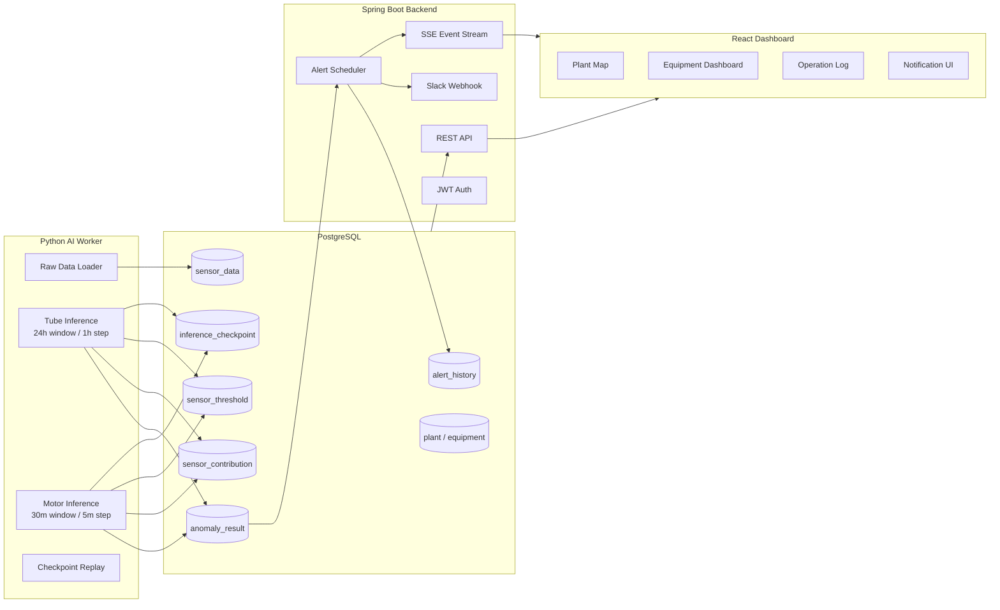
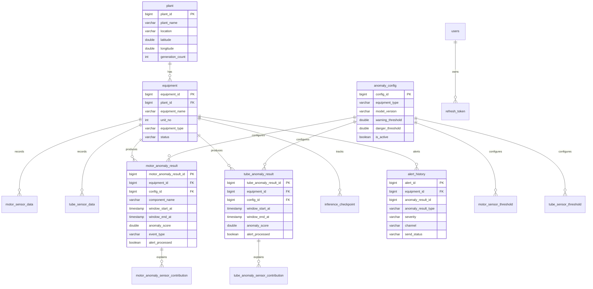

# KOWEPO-EMS Predictive Maintenance

KOWEPO-EMS는 한국서부발전 발전 설비의 센서 데이터를 기반으로 이상 징후를 탐지하고, 설비 상태를 실시간 대시보드와 Slack 알림으로 제공하는 예지보전 모니터링 시스템입니다.

튜브와 고압전동기 데이터를 PostgreSQL에 적재한 뒤 Python AI Worker가 윈도우 단위로 이상 점수를 계산합니다. Spring Boot 백엔드는 센서 데이터, 추론 결과, 알림 이력을 API와 SSE로 제공하고, React 대시보드는 발전본부/호기/설비 단위로 상태를 시각화합니다.

## Key Features

- 발전본부별 설비 현황: 태안, 평택, 서인천, 군산, 김포 발전본부의 설비 상태와 위치 시각화
- 상세 대시보드: 튜브/고압전동기 이상 점수 추이, 이벤트 타임라인, 실시간 센서 현황, 기여도, 운전 상태 변화 표시
- AI 추론 파이프라인: 튜브 24시간 윈도우/1시간 스텝, 고압전동기 30분 윈도우/5분 스텝 기반 이상 탐지
- Checkpoint Replay: `inference_checkpoint` 기준으로 마지막 처리 시점 이후의 데이터만 순차 처리
- Slack 알림: 신규 이상 결과를 감지하고 상태 전이 기준으로 중복 알림을 줄인 Slack Webhook 전송
- SSE 실시간 갱신: 백엔드 이벤트 스트림으로 프론트엔드가 필요한 API만 다시 조회
- JWT 인증: 로그인, access token, refresh token 기반 인증 흐름

## Architecture



## Data Pipeline

1. Source data load
   - Tube source: `ai/data/tube/tube.csv`
   - Motor source: `ai/data/motor/simulation_25_12_30.csv`
   - 동일 원천 데이터를 여러 발전본부/호기 설비에 복제 적재하여 설비별 모니터링 시나리오를 구성합니다.

2. AI inference
   - Tube: 24시간 윈도우, 1시간 스텝으로 이상 점수와 센서 기여도를 계산합니다.
   - Motor: 30분 윈도우, 5분 스텝으로 컴포넌트별 이상 점수, 이벤트 타입, 센서 기여도, 동적 센서 임계값을 계산합니다.
   - Worker는 `inference_checkpoint`를 기준으로 이미 처리한 구간을 건너뛰고 다음 윈도우부터 이어서 처리합니다.

3. Result storage
   - 추론 결과는 `tube_anomaly_result`, `motor_anomaly_result`에 저장합니다.
   - 원인 분석용 기여도는 `tube_anomaly_sensor_contribution`, `motor_anomaly_sensor_contribution`에 저장합니다.
   - 윈도우별 동적 센서 임계값은 `tube_sensor_threshold`, `motor_sensor_threshold`에 저장합니다.

4. Alert processing
   - Spring Boot Scheduler가 `alert_processed = false`인 신규 이상 결과를 조회합니다.
   - `anomaly_config`의 warning/danger 기준으로 severity를 계산합니다.
   - 알림 이력을 `alert_history`에 저장하고, Slack Webhook으로 최종 알림을 전송합니다.
   - 처리 완료된 결과는 `alert_processed = true`로 변경해 중복 알림을 줄입니다.

5. Frontend refresh
   - React는 SSE 연결(`/api/events/stream`)을 유지합니다.
   - 이벤트를 받으면 발전기 현황, 상세 대시보드, 운영 로그, 알림 UI에 필요한 API만 다시 조회합니다.

## ERD



## API Summary

Base URL: `/api`

| Method | Path | Description |
| --- | --- | --- |
| `POST` | `/auth/signup` | 회원 가입 |
| `POST` | `/auth/login` | 로그인 및 access/refresh token 발급 |
| `POST` | `/auth/refresh` | refresh token으로 access token 재발급 |
| `GET` | `/plants` | 발전본부 목록 조회 |
| `GET` | `/equipments?plantId={id}` | 설비 목록 조회 |
| `GET` | `/equipments/summary` | 설비 상태 요약 조회 |
| `GET` | `/equipments/{equipmentId}` | 설비 상세 조회 |
| `GET` | `/equipments/{equipmentId}/sensor-data?limit={n}` | 최신 센서 데이터 조회 |
| `GET` | `/equipments/{equipmentId}/sensor-thresholds` | 동적 센서 임계값 조회 |
| `GET` | `/equipments/{equipmentId}/anomalies?component={name}&limit={n}` | 이상 탐지 결과 조회 |
| `GET` | `/equipments/{equipmentId}/anomalies/{anomalyResultId}/contributions` | 이상 원인 센서 기여도 조회 |
| `GET` | `/alerts?type={MOTOR\|TUBE}&severity={WARNING\|DANGER}&limit={n}` | Slack 알림 이력 조회 |
| `POST` | `/alerts/motor/{anomalyResultId}/send` | 모터 Slack 알림 수동 전송 |
| `POST` | `/alerts/tube/{anomalyResultId}/send` | 튜브 Slack 알림 수동 전송 |
| `GET` | `/events/stream` | SSE 이벤트 스트림 |

상세 명세는 [docs/api-spec.md](docs/api-spec.md)를 참고합니다.

## Tech Stack

| Layer | Stack |
| --- | --- |
| Frontend | React 19, Vite, TypeScript, Recharts, Lucide React, Kakao Map JavaScript API |
| Backend | Java 21, Spring Boot 4, Spring Security, Spring Data JPA, JWT, SSE |
| Database | PostgreSQL 15 |
| AI Pipeline | Python 3.11, pandas, NumPy, scikit-learn, PyTorch, TensorFlow, psycopg2 |
| Infra | Docker, Docker Compose, AWS EC2, Nginx |
| Notification | Slack Incoming Webhook |

## Project Structure

```text
predictive-maintenance/
├─ ai/
│  ├─ data/
│  │  ├─ motor/
│  │  └─ tube/
│  ├─ models/
│  └─ src/
│     ├─ motor/
│     └─ tube/
├─ backend/
│  └─ src/main/java/org/example/backend/
├─ docs/
├─ frontend/
│  └─ src/
├─ init.sql
├─ docker-compose.yml
└─ README.md
```

## Environment Variables

민감한 값은 Git에 커밋하지 않고 `.env`, IDE Run Configuration, Shell 환경 변수로 관리합니다.

### Backend

```env
SPRING_DATASOURCE_URL=jdbc:postgresql://localhost:5432/predictive_maintenance
SPRING_DATASOURCE_USERNAME=postgres
SPRING_DATASOURCE_PASSWORD=1234
SLACK_WEBHOOK_URL=https://hooks.slack.com/services/...
```

### Frontend

`frontend/.env` 파일을 생성합니다.

```env
VITE_API_BASE_URL=http://localhost:8080
VITE_KAKAO_MAP_KEY=your_kakao_javascript_key
```

### AI Worker

```powershell
$env:DB_HOST="localhost"
$env:DB_PORT="5432"
$env:DB_NAME="predictive_maintenance"
$env:DB_USER="postgres"
$env:DB_PASSWORD="1234"
```

AWS EC2의 PostgreSQL에 직접 적재하거나 추론 결과를 저장할 때는 `DB_HOST`를 EC2 Public IP로 변경합니다.

## Local Run

### 1. PostgreSQL

```bash
docker compose up -d postgres
```

초기 스키마와 seed 데이터는 `init.sql`을 기준으로 생성됩니다.

### 2. Backend

Windows PowerShell:

```powershell
cd backend
.\gradlew.bat bootRun
```

Linux/macOS:

```bash
cd backend
./gradlew bootRun
```

### 3. Frontend

```bash
cd frontend
npm install
npm run dev
```

기본 프론트엔드 주소는 `http://localhost:3000`입니다.

### 4. Python Environment

Windows PowerShell:

```powershell
py -3.11 -m venv .venv
.\.venv\Scripts\Activate.ps1
python -m pip install --upgrade pip
pip install -r ai\requirements.txt
```

### 5. Source Data Load

```powershell
python ai\src\tube\db_loader.py
python ai\src\tube\set_thresholds.py
python ai\src\motor\load_real_15.py
```

### 6. AI Worker

Tube worker:

```powershell
$env:TUBE_RUN_MODE="replay"
$env:TUBE_MAX_WINDOWS_PER_RUN="1"
$env:TUBE_WORKER_INTERVAL_SECONDS="60"
python ai\src\tube\worker.py
```

Motor worker:

```powershell
$env:MOTOR_RUN_MODE="replay"
$env:MOTOR_MAX_WINDOWS_PER_RUN="1"
$env:MOTOR_WORKER_INTERVAL_SECONDS="60"
python ai\src\motor\worker.py
```

## Deployment Notes

- EC2에는 PostgreSQL, Spring Boot Backend, React/Nginx Frontend를 배포할 수 있습니다.
- Python AI Worker는 EC2에서 실행하거나, 로컬 PC에서 EC2 PostgreSQL을 바라보도록 실행할 수 있습니다.
- 로컬 Worker로 EC2 DB에 결과를 적재하려면 `DB_HOST`를 EC2 Public IP로 설정하고 EC2 보안 그룹에서 PostgreSQL 포트 접근을 허용해야 합니다.
- Kakao Map JavaScript Key는 실제 접속 도메인 또는 `localhost:3000`을 Kakao Developers의 JavaScript SDK 도메인에 등록해야 정상 동작합니다.

## Troubleshooting

| Symptom | Cause | Fix |
| --- | --- | --- |
| GitHub compare 화면에 변경 사항이 없음 | 이미 base 브랜치에 merge된 브랜치 비교 | 최신 코드는 `develop` 또는 `main` 브랜치를 확인 |
| Spring Boot 8080 포트 충돌 | 기존 백엔드 프로세스가 실행 중 | 기존 프로세스를 종료하거나 `server.port` 변경 |
| Slack 알림이 전송되지 않음 | `SLACK_WEBHOOK_URL` 미설정 또는 webhook 비활성 | 백엔드 환경 변수 확인 |
| Kakao Map이 지도 대신 정적 화면처럼 보임 | JavaScript Key 또는 SDK 도메인 설정 문제 | `VITE_KAKAO_MAP_KEY`와 Kakao Developers 도메인 등록 확인 |
| Python에서 `ModuleNotFoundError: pandas` 발생 | 가상환경 미활성화 또는 패키지 미설치 | `.venv` 활성화 후 `pip install -r ai\requirements.txt` |
| TensorFlow 설치 실패 | Python 버전 불일치 | Python 3.11 가상환경 사용 |
| Worker를 재시작하면 어디서부터 도는지 헷갈림 | checkpoint 기반 replay 구조 | `inference_checkpoint`를 확인. 처음부터 재생하려면 결과/기여도/알림/checkpoint 테이블 초기화 |
| 운영 로그가 특정 설비만 보임 | 최신 결과 limit이 한 타입/한 설비로 쏠림 | type별 조회와 limit 분리 적용 여부 확인 |

## Reset Inference Results Only

원천 데이터는 유지하고 추론 결과만 처음부터 다시 보고 싶을 때 사용합니다.

```sql
TRUNCATE TABLE
    tube_anomaly_sensor_contribution,
    motor_anomaly_sensor_contribution,
    alert_history,
    tube_anomaly_result,
    motor_anomaly_result,
    inference_checkpoint,
    motor_sensor_threshold
RESTART IDENTITY CASCADE;
```
