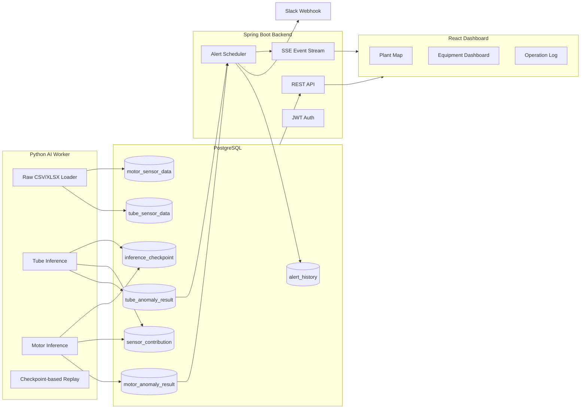

# KOWEPO-EMS: 발전설비 예지보전 모니터링 시스템

한국서부발전 발전설비의 센서 데이터를 기반으로 이상 징후를 탐지하고, 설비 상태를 실시간 대시보드와 Slack 알림으로 제공하는 예지보전 모니터링 시스템입니다.

튜브와 고압전동기 센서 데이터를 PostgreSQL에 적재한 뒤 Python AI 파이프라인이 윈도우 단위로 이상 점수를 산출하고, Spring Boot 백엔드가 결과를 가공하여 React 대시보드에 실시간으로 전달합니다.

## 핵심 목표

- 발전설비 센서 데이터를 설비별, 시점별로 저장하고 추론 결과를 추적 가능하게 관리
- 튜브 및 고압전동기 이상 징후를 AI 모델과 도메인 룰 기반으로 탐지
- 이상 결과 발생 시 대시보드, 운영 로그, Slack 알림까지 이어지는 관제 흐름 구현
- Polling 중심 구조를 줄이고 SSE 기반 이벤트 전달로 실시간성 확보

## 주요 기능

- 발전소 현황: 태안, 평택, 서인천, 군산, 김포 발전본부의 설비 현황 및 상태 시각화
- 설비 상세 대시보드: 튜브와 고압전동기 이상 점수 추이, 이벤트 타임라인, 실시간 센서 현황 표시
- AI 추론 파이프라인: 튜브 24시간 윈도우, 고압전동기 30분 윈도우 기반 이상 탐지
- 운영 로그: 설비별 이상 이벤트, 이상 점수, Slack 전송 상태, 원인 분석 패널 제공
- Slack 알림: 정상에서 주의/위험으로 상태가 바뀌는 순간 알림 전송
- SSE 실시간 갱신: 백엔드가 신규 이상 결과와 알림 이벤트를 프론트에 즉시 통지
- 지도 시각화: Kakao Map JavaScript API 기반 발전본부 위치 표시

## 시스템 아키텍처



## 데이터 파이프라인

1. 원천 데이터 적재
   - 튜브 원천 데이터는 `ai/data/tube/tube.csv`를 기준으로 `tube_sensor_data`에 적재합니다.
   - 고압전동기 원천 데이터는 `ai/data/motor/simulation_25_12_30.csv`를 기준으로 `motor_sensor_data`에 적재합니다.
   - 같은 원천 데이터를 여러 발전본부/호기에 복제하여 설비별 상태를 시뮬레이션합니다.

2. AI 추론
   - 튜브: 24시간 윈도우, 1시간 스텝 기준으로 이상 점수와 센서 기여도를 계산합니다.
   - 고압전동기: 30분 윈도우, 5분 스텝 기준으로 이상 점수, 이벤트 타입, 센서 기여도를 계산합니다.
   - `inference_checkpoint`를 사용해 마지막 처리 위치 이후의 데이터만 이어서 처리합니다.

3. 결과 저장
   - 추론 결과는 `tube_anomaly_result`, `motor_anomaly_result`에 저장합니다.
   - 원인 분석용 기여도는 `tube_anomaly_sensor_contribution`, `motor_anomaly_sensor_contribution`에 저장합니다.
   - 고압전동기는 윈도우별 동적 센서 임계값을 `motor_sensor_threshold`에 저장합니다.

4. 백엔드 알림 처리
   - Spring Boot 스케줄러가 `alert_processed = false`인 신규 이상 결과를 감지합니다.
   - `anomaly_config` 기준으로 NORMAL, WARNING, DANGER 상태를 계산합니다.
   - 이전 상태와 비교해 상태가 상승하거나 변경된 경우 `alert_history`에 기록하고 Slack 알림을 전송합니다.
   - 처리 완료된 결과는 `alert_processed = true`로 변경하여 중복 알림을 방지합니다.

5. 프론트 실시간 반영
   - 백엔드는 SSE로 신규 이벤트 발생을 프론트에 알립니다.
   - 프론트는 이벤트를 받으면 필요한 API를 다시 조회해 그래프, 운영 로그, 알림 UI를 갱신합니다.

## 기술 스택

| 영역 | 기술 |
| --- | --- |
| Frontend | React 19, Vite, TypeScript, Recharts, Lucide React, Kakao Map JavaScript API |
| Backend | Java 21, Spring Boot 4, Spring Security, Spring Data JPA, SSE, JWT |
| Database | PostgreSQL 15 |
| AI Pipeline | Python 3.11, pandas, NumPy, scikit-learn, PyTorch, TensorFlow, psycopg2 |
| Infra | Docker, Docker Compose, AWS EC2, Nginx |
| Notification | Slack Incoming Webhook |

## 프로젝트 구조

```text
predictive-maintenance/
├─ ai/
│  ├─ data/
│  │  ├─ motor/
│  │  └─ tube/
│  ├─ models/
│  └─ src/
│     ├─ motor/
│     └─ tube/
├─ backend/
│  └─ src/main/java/org/example/backend/
├─ frontend/
│  └─ src/
├─ init.sql
├─ docker-compose.yml
└─ README.md
```

## 환경 변수

민감한 값은 Git에 커밋하지 않고 로컬 또는 서버의 `.env`, IDE Run Configuration, Shell 환경 변수로 관리합니다.

### Backend

```env
SPRING_DATASOURCE_URL=jdbc:postgresql://localhost:5432/predictive_maintenance
SPRING_DATASOURCE_USERNAME=postgres
SPRING_DATASOURCE_PASSWORD=1234
SLACK_WEBHOOK_URL=https://hooks.slack.com/services/...
```

### Frontend

`frontend/.env` 파일을 생성합니다.

```env
VITE_API_BASE_URL=http://localhost:8080
VITE_KAKAO_MAP_KEY=your_kakao_javascript_key
```

### AI Worker

로컬 DB를 사용할 때:

```powershell
$env:DB_HOST="localhost"
$env:DB_PORT="5432"
$env:DB_NAME="predictive_maintenance"
$env:DB_USER="postgres"
$env:DB_PASSWORD="1234"
```

AWS EC2 DB에 직접 적재하거나 추론 결과를 저장할 때는 `DB_HOST`를 EC2 퍼블릭 IP로 변경합니다.

## 로컬 실행

### 1. PostgreSQL 실행

```bash
docker compose up -d postgres
```

초기 스키마와 시드 데이터는 `init.sql`을 기준으로 생성됩니다.

### 2. Backend 실행

Windows PowerShell:

```powershell
cd backend
.\gradlew.bat bootRun
```

Linux/macOS:

```bash
cd backend
./gradlew bootRun
```

기본 API 주소는 `http://localhost:8080`입니다.

### 3. Frontend 실행

```bash
cd frontend
npm install
npm run dev
```

기본 프론트 주소는 `http://localhost:3000`입니다.

### 4. Python 가상환경 및 패키지 설치

Windows PowerShell:

```powershell
py -3.11 -m venv .venv
.\.venv\Scripts\Activate.ps1
python -m pip install --upgrade pip
pip install -r ai\requirements.txt
```

### 5. 원천 데이터 적재

```powershell
python ai\src\tube\db_loader.py
python ai\src\tube\set_thresholds.py
python ai\src\motor\load_real_15.py
```

### 6. AI Worker 실행

튜브 워커:

```powershell
$env:TUBE_RUN_MODE="replay"
$env:TUBE_MAX_WINDOWS_PER_RUN="1"
$env:TUBE_WORKER_INTERVAL_SECONDS="60"
python ai\src\tube\worker.py
```

고압전동기 워커:

```powershell
$env:MOTOR_RUN_MODE="replay"
$env:MOTOR_MAX_WINDOWS_PER_RUN="1"
$env:MOTOR_WORKER_INTERVAL_SECONDS="60"
python ai\src\motor\worker.py
```

## 배포 구성

현재 배포 기준 구성은 다음과 같습니다.

- AWS EC2: PostgreSQL, Spring Boot Backend, React/Nginx Frontend 실행
- Local PC: Python AI Worker 실행 가능
- Local AI Worker는 `DB_HOST`를 EC2 DB로 설정하여 AWS PostgreSQL에 원천 데이터와 추론 결과를 직접 저장할 수 있습니다.

이 구성을 사용하면 프론트와 백엔드는 서버에 고정 배포하고, 발표/시연용 AI 데이터 스트림은 로컬에서 제어할 수 있습니다.

## 주요 설계 포인트

### Sensor Data와 Result Data 분리

원천 센서 데이터와 AI 추론 결과를 분리하여 저장합니다. 이를 통해 같은 원천 데이터로 모델을 재실행하거나, 결과 테이블과 체크포인트만 초기화해 동일한 시연 흐름을 다시 재생할 수 있습니다.

### Checkpoint 기반 Replay

AI Worker는 `inference_checkpoint`를 기준으로 마지막 처리 시점 이후의 윈도우만 처리합니다. 따라서 워커를 재시작해도 이미 처리된 구간을 반복하지 않고 이어서 실행됩니다.

### Slack 알림 중복 방지

백엔드는 신규 결과를 감지한 뒤 이전 알림 상태와 비교합니다. 같은 상태가 반복되는 동안에는 Slack 알림을 계속 보내지 않고, 정상에서 주의 또는 위험으로 바뀌는 의미 있는 전환만 알림으로 남깁니다.

### SSE 기반 실시간 갱신

프론트가 짧은 주기로 모든 데이터를 반복 조회하는 대신, 백엔드가 SSE 이벤트를 보내면 프론트가 필요한 데이터만 다시 조회합니다. 이 구조는 실시간성을 유지하면서 불필요한 API 호출을 줄입니다.

## 발표/시연 팁

- 전체 데이터 흐름 설명: 원천 데이터 적재 → AI 추론 → DB 저장 → 백엔드 감지 → Slack/SSE → 프론트 갱신
- 시연 영상용 데이터는 결과 테이블과 체크포인트만 초기화하면 같은 구간을 다시 재생할 수 있습니다.
- AWS DB를 바라보고 로컬 워커를 실행할 경우, 로컬에서 적재한 데이터가 AWS 대시보드에 바로 반영됩니다.

## 라이선스

본 프로젝트는 교육 및 포트폴리오 목적의 팀 프로젝트입니다.
