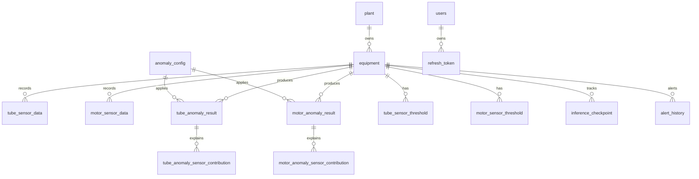

# Database Guide

KOWEPO-EMS uses PostgreSQL as the single source of truth for plant metadata, raw sensor streams, AI inference results, contribution data, checkpoint state, and alert history.

## Local Database

Default connection:

| Item | Value |
| --- | --- |
| Database | `predictive_maintenance` |
| User | `postgres` |
| Password | `1234` |
| Port | `5432` |
| Container | `my_postgres` |

Start PostgreSQL:

```bash
docker compose up -d postgres
```

Connect with `psql`:

```bash
docker exec -it my_postgres psql -U postgres -d predictive_maintenance
```

The schema and seed data are defined in [init.sql](../init.sql). If the Docker volume already exists, `init.sql` will not be re-run automatically. Recreate the DB only when you intentionally want a clean database.

## Core Tables

| Table | Purpose |
| --- | --- |
| `plant` | Power plant metadata shown on the plant status map/list. |
| `equipment` | Generator/tube/motor equipment metadata by plant and unit. |
| `tube_sensor_data` | Raw gasifier tube sensor readings. |
| `motor_sensor_data` | Raw high-voltage motor sensor readings. |
| `tube_sensor_threshold` | Dynamic or configured tube sensor thresholds. |
| `motor_sensor_threshold` | Window-level dynamic motor sensor thresholds. |
| `anomaly_config` | Global warning/danger thresholds by equipment type/model version. |
| `tube_anomaly_result` | Tube inference scores and window timestamps. |
| `motor_anomaly_result` | Motor inference scores, event type, and descriptions. |
| `tube_anomaly_sensor_contribution` | Tube top contributing sensors for each result. |
| `motor_anomaly_sensor_contribution` | Motor top contributing sensors for each result. |
| `inference_checkpoint` | Last processed replay window for each worker/equipment. |
| `alert_history` | Slack send status and alert metadata. |
| `users` | Login users. |
| `refresh_token` | JWT refresh token storage. |

## ERD Summary



## Inference Reset

Use this when you want to keep the raw source data but replay the AI workers from the beginning.

```sql
TRUNCATE TABLE
    tube_anomaly_sensor_contribution,
    motor_anomaly_sensor_contribution,
    alert_history,
    tube_anomaly_result,
    motor_anomaly_result,
    inference_checkpoint,
    motor_sensor_threshold
RESTART IDENTITY CASCADE;
```

This does not delete `tube_sensor_data`, `motor_sensor_data`, `plant`, `equipment`, users, or global configs.

## Full Source Data Reload

Use this only when you need to replace the raw CSV data itself.

```powershell
python ai\src\tube\db_loader.py
python ai\src\tube\set_thresholds.py
python ai\src\motor\load_real_15.py
```

The loaders clear their own source and derived tables for the relevant equipment type before inserting the new source data.

## Notes

- `measured_at` is the source timestamp used for charts and replay windows.
- `created_at` is the database insert timestamp.
- Python workers, Spring Boot, and React must point to the same PostgreSQL instance.
- For AWS deployment, local worker terminals can target the EC2 database by setting `DB_HOST`, `DB_PORT`, `DB_NAME`, `DB_USER`, and `DB_PASSWORD`.
- `alert_history.anomaly_result_id` is intentionally stored with `anomaly_result_type` because alerts can reference either tube or motor result tables.
