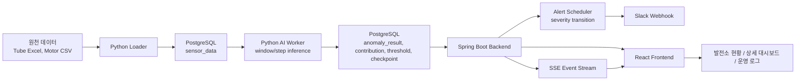

# 예지보전 시스템 발표 준비 문서

이 문서는 발표자가 프로젝트의 문제정의, 설계 의도, 구현 방식, 기술 선택 근거, 대안, 한계와 개선 방향, 예상 질문 답변까지 한 번에 준비할 수 있도록 정리한 발표 가이드입니다.

## 1. 한 문장 소개

우리 프로젝트는 발전소의 가스화기 튜브와 고압전동기 센서 데이터를 기반으로 이상 징후를 탐지하고, 결과를 DB에 저장한 뒤 백엔드와 프론트를 통해 실시간에 가깝게 시각화하고 Slack 알림까지 연결하는 예지보전 시스템입니다.

## 2. 문제 정의

발전 설비는 장애가 발생한 뒤 수리하는 방식으로 운영하면 정지 비용과 안전 리스크가 큽니다. 특히 가스화기 튜브와 고압전동기는 발전소 운영에 중요한 설비이기 때문에, 이상 징후를 늦게 발견하면 계획되지 않은 정지, 정비 비용 증가, 운영 신뢰도 저하로 이어질 수 있습니다.

기존 관제 방식의 한계는 다음과 같습니다.

- 단일 센서의 임계값만 보면 복합적인 이상 패턴을 놓칠 수 있습니다.
- 운영자가 여러 센서 값을 직접 비교해야 하므로 이상 원인 파악이 느립니다.
- 과거 로그, 현재 센서 값, 모델 결과, 알림 이력이 분리되어 있으면 상황 판단이 어렵습니다.
- 설비별 상태가 실시간으로 갱신되지 않으면 발표나 운영 관점에서 시스템 신뢰도가 낮아집니다.

따라서 이 프로젝트의 핵심 문제는 “다중 센서 데이터를 이용해 설비 이상을 조기에 탐지하고, 그 결과를 운영자가 이해 가능한 형태로 연결하는 것”입니다.

## 3. 목표

프로젝트 목표는 단순히 모델 점수를 계산하는 것이 아니라, 실제 운영 시스템처럼 데이터 흐름 전체를 연결하는 것입니다.

- 데이터 적재: 튜브와 모터 원천 데이터를 DB에 저장합니다.
- AI 추론: 윈도우/스텝 기반으로 데이터를 가져와 모델링하고 이상 점수를 계산합니다.
- 결과 저장: 이상 점수, 이벤트 타입, 센서별 기여도, 임계값, 체크포인트를 DB에 저장합니다.
- 백엔드 제공: DB 데이터를 API로 조회하고, 새 이상 결과를 감지해 알림 이력을 만듭니다.
- 프론트 시각화: 발전소 현황, 설비 상세, 센서 현황, 이상 추이, 운영 로그, 원인 분석을 보여줍니다.
- 알림: 상태 변화가 발생하면 Slack으로 전송하고 알림 이력을 남깁니다.
- 실시간성: worker, scheduler, SSE/polling을 통해 화면을 계속 갱신합니다.

## 4. 전체 아키텍처

역할을 분리한 이유는 다음과 같습니다.

- Python은 데이터 처리와 모델 추론에 강점이 있습니다.
- Spring Boot는 API, 인증, 스케줄링, 알림 처리에 적합합니다.
- PostgreSQL은 센서 데이터와 추론 결과를 일관성 있게 저장하기 좋습니다.
- React는 운영자가 데이터를 한 화면에서 해석할 수 있는 대시보드 구현에 적합합니다.

## 5. DB 설계

DB는 단순 저장소가 아니라 파이프라인의 기준점입니다.

핵심 테이블은 다음과 같습니다.

| 영역 | 테이블 | 역할 |
|---|---|---|
| 기준 정보 | `plant` | 발전본부 정보 저장 |
| 기준 정보 | `equipment` | 발전본부별 호기, 설비 타입, 상태 저장 |
| 원천 데이터 | `tube_sensor_data` | 튜브 센서 시계열 데이터 |
| 원천 데이터 | `motor_sensor_data` | 모터 센서 시계열 데이터 |
| 설정 | `anomaly_config` | 설비 타입별 warning/danger 기준 |
| 동적 기준 | `tube_sensor_threshold` | 튜브 센서별 윈도우 기준 임계값 |
| 동적 기준 | `motor_sensor_threshold` | 모터 센서별 윈도우 기준 임계값 |
| 추론 결과 | `tube_anomaly_result` | 튜브 이상 점수 결과 |
| 추론 결과 | `motor_anomaly_result` | 모터 이상 점수 결과, component 포함 |
| 원인 분석 | `tube_anomaly_sensor_contribution` | 튜브 센서별 이상 기여도 |
| 원인 분석 | `motor_anomaly_sensor_contribution` | 모터 센서별 이상 기여도 |
| 진행 상태 | `inference_checkpoint` | worker가 어디까지 처리했는지 기록 |
| 알림 | `alert_history` | Slack 전송 이력과 severity 변화 저장 |
| 인증 | `users`, `refresh_token` | 로그인과 토큰 갱신 |

### 설계 근거

- `equipment`를 중심으로 모든 센서/결과/알림을 연결하면 발전본부, 호기, 설비별 조회가 쉬워집니다.
- `inference_checkpoint`를 두면 worker가 매번 처음부터 돌지 않고 다음 윈도우만 처리할 수 있습니다.
- `alert_processed` 플래그를 두면 백엔드 scheduler가 아직 알림 처리하지 않은 결과만 안전하게 읽을 수 있습니다.
- `component_name`을 모터 결과에 추가해 MAC A, MAC B, BAC, DGAN, VHP를 분리했습니다.

### 대안

| 대안 | 장점 | 단점 | 채택 여부 |
|---|---|---|---|
| CSV 파일만으로 프론트 표시 | 구현이 빠름 | 실시간성, 이력 관리, 알림 처리 어려움 | 미채택 |
| 결과를 메모리에만 저장 | 빠름 | 서버 재시작 시 데이터 손실 | 미채택 |
| 센서별 테이블을 모두 분리 | 정규화 명확 | 쿼리와 적재 코드 복잡도 증가 | 미채택 |
| 현재처럼 설비별 wide table | 적재와 모델 입력이 단순 | component 필터링 주의 필요 | 채택 |

## 6. 데이터 적재 로직

### 튜브 데이터

튜브 데이터는 Excel 기반 데이터셋을 읽어 `tube_sensor_data`에 적재합니다. 모든 발전소/호기에 동일한 튜브 데이터를 복제해 넣어, 같은 입력 데이터가 여러 설비 화면에서 동일하게 보일 수 있도록 했습니다.

적재 시 처리 내용:

- 필요한 컬럼만 선택합니다.
- 시간 컬럼을 datetime으로 변환합니다.
- 결측치가 있는 행을 제거합니다.
- 기존 튜브 원천 데이터와 파생 결과를 정리한 뒤 새로 적재합니다.
- 튜브 threshold와 anomaly 결과는 추론 단계에서 DB에 저장됩니다.

### 모터 데이터

모터 데이터는 CSV 기반 데이터셋을 읽어 `motor_sensor_data`에 적재합니다. 현재 데이터셋은 한 개이지만, 발표/검증 목적상 모든 고압전동기 설비에 같은 데이터를 복제해 저장합니다.

모터 데이터는 하나의 row 안에 MAC A, MAC B, BAC, DGAN, VHP 센서 컬럼이 함께 존재하는 wide table 구조입니다. 따라서 모델링 시에는 `equipment_id`만으로 부품을 구분하면 안 되고, `component_name`으로 MAC A~VHP를 다시 분리해야 합니다.

이 문제를 해결하기 위해 현재 파이프라인은 다음 방식으로 동작합니다.

- `equipment_id`: 발전소/호기별 고압전동기 설비
- `component_name`: MAC_A, MAC_B, BAC, DGAN, VHP
- 프론트 탭 선택 시 component별 API 필터 사용
- 결과 저장 시 `(equipment_id, config_id, component_name, window_start_at, window_end_at)` 기준 upsert

## 7. AI 추론 로직

## 7.1 튜브 모델

튜브는 24시간 윈도우와 1시간 스텝을 기준으로 이상 징후를 탐지합니다.

흐름:

1. DB에서 튜브 센서 데이터를 읽습니다.
2. scaler와 모델을 로드합니다.
3. `WINDOW_SIZE=24`, `STEP_SIZE=1` 기준으로 슬라이딩 윈도우를 생성합니다.
4. 모델 복원 오차를 기반으로 anomaly score를 계산합니다.
5. 이상 점수와 센서별 기여도를 DB에 저장합니다.
6. `inference_checkpoint`를 갱신합니다.

튜브는 연속적인 공정 데이터이기 때문에 시간 흐름에 따른 패턴 변화가 중요합니다. 단일 시점 값보다 윈도우 기반으로 보는 것이 더 안정적입니다.

### 튜브 threshold

튜브는 `set_thresholds.py`에서 3-sigma 기반 윈도우별 threshold를 계산해 `tube_sensor_threshold`에 저장합니다. 모델 점수 기준으로 warning/danger를 판단하고, 센서별 threshold는 화면에서 현재 센서 값의 정상 범위를 해석하는 데 사용됩니다.

## 7.2 모터 모델

모터는 30분 윈도우와 5분 스텝을 기준으로 분석합니다. 각 윈도우에서 MAC A, MAC B, BAC, DGAN, VHP를 component별로 분리해 처리합니다.

흐름:

1. DB에서 고압전동기 센서 데이터를 읽습니다.
2. component별 target sensor 7개만 추출합니다.
3. 전류 기반 STOP 필터를 먼저 적용합니다.
4. 가동 상태면 7개 센서의 평균과 표준편차를 계산해 14차원 feature를 만듭니다.
5. component별 scaler와 autoencoder 모델로 복원 오차를 계산합니다.
6. component별 denominator로 anomaly score를 0~1 범위로 정규화합니다.
7. 도메인 룰로 `BURST`, `IMBALANCE`, `LOAD_CHANGE`, `TREND_CHANGE`, `RELATION_CHANGE` 같은 이벤트를 판단합니다.
8. 모델 오차 기반으로 `UNKNOWN_CRITICAL`, `UNKNOWN_DRIFT`를 보완합니다.
9. 센서별 contribution을 계산해 DB에 저장합니다.
10. 윈도우별 센서 threshold를 `motor_sensor_threshold`에 upsert합니다.
11. 체크포인트를 갱신합니다.

### STOP 처리

고압전동기는 전류가 0 이하이거나 최근 전류가 가동 임계치 이하이면 정지 상태로 판단합니다. 이 경우 모델 추론을 돌리지 않고 anomaly score를 0으로 저장합니다.

이 처리가 필요한 이유:

- 정지 중인 설비에 모델을 적용하면 의미 없는 이상 점수가 나올 수 있습니다.
- 전류가 음수인 경우 실제 물리값이라기보다 노이즈 또는 정지 상태 표현일 수 있습니다.
- 정지 상태는 장애 이상과 구분해야 운영 화면이 과도하게 위험으로 보이지 않습니다.

### 모터 component 분리

초기 문제 중 하나는 MAC A 화면인데 MAC B, BAC, VHP 데이터가 섞이는 현상이었습니다. 원인은 wide table 구조에서 `equipment_id`만 기준으로 데이터를 읽고, component 필터가 제대로 걸리지 않았기 때문입니다.

해결:

- 파이프라인은 component별 결과를 `component_name`과 함께 저장합니다.
- 백엔드는 `/api/equipments/{equipmentId}/anomalies?component=MAC_A` 방식으로 조회할 수 있습니다.
- 프론트는 현재 선택한 탭에 해당하는 component만 요청합니다.

## 8. 백엔드 로직

백엔드는 Spring Boot 기반이며, DB에 저장된 데이터를 REST API로 제공합니다.

주요 API:

| API | 역할 |
|---|---|
| `GET /api/plants` | 발전본부 목록 |
| `GET /api/equipments?plantId=` | 발전본부별 설비 목록 |
| `GET /api/equipments/{id}/sensor-data` | 설비 센서 데이터 |
| `GET /api/equipments/{id}/sensor-thresholds` | 센서 threshold |
| `GET /api/equipments/{id}/anomalies` | 이상 결과 |
| `GET /api/equipments/{id}/anomalies?component=MAC_A` | 모터 component별 이상 결과 |
| `GET /api/equipments/{id}/anomalies/{resultId}/contributions` | 센서별 기여도 |
| `GET /api/alerts` | 알림 이력 |
| `GET /api/events/stream` | SSE 실시간 이벤트 스트림 |
| `POST /api/auth/login` | 로그인 |
| `POST /api/auth/refresh` | access token 갱신 |

### Alert Scheduler

백엔드는 주기적으로 `alert_processed=false`인 anomaly 결과를 조회합니다. 새 결과가 있으면 다음 흐름으로 처리합니다.

1. anomaly score와 `anomaly_config`의 warning/danger threshold를 비교합니다.
2. 설비 상태를 NORMAL/WARNING/DANGER로 갱신합니다.
3. 이전 알림 severity와 현재 severity가 다를 때만 alert_history를 생성합니다.
4. Slack Webhook으로 알림을 보냅니다.
5. SSE 이벤트를 발행해 프론트가 새 데이터를 다시 읽게 합니다.

### 왜 severity transition만 알림을 보내는가

모든 윈도우마다 Slack을 보내면 알림이 폭주합니다. 따라서 상태가 NORMAL에서 WARNING, WARNING에서 DANGER처럼 변화할 때만 알림을 생성합니다. 이는 실제 운영 환경에서도 알림 피로도를 줄이기 위한 중요한 설계입니다.

### 모터 알림 상세 원인 분석 보정

모터는 같은 시각에 MAC A~VHP 여러 component 결과가 저장됩니다. 알림 메시지는 같은 시각의 최악 점수를 기준으로 만들어야 하고, 상세 패널도 최악 점수의 `anomaly_result_id`를 따라가야 합니다.

이를 맞추기 위해 알림 저장 시 같은 equipment/time의 최악 `MotorAnomalyResult`를 찾아 그 ID를 `alert_history.anomaly_result_id`로 저장하도록 보정했습니다. 이 덕분에 운영 로그 상세에서 점수와 센서별 기여도가 0으로 잘못 보이는 문제를 해결했습니다.

## 9. 프론트엔드 로직

프론트는 React/Vite 기반 대시보드입니다.

핵심 화면:

- 로그인 화면
- 발전소 현황 지도/카드
- 발전본부별 발전기 현황
- 고압전동기 상세 대시보드
- 가스화기 상세 대시보드
- 운영 로그
- 상세 원인 분석 패널
- Slack 알림 드롭다운

### 발전소 현황

발전본부 목록과 DB 기준 설비 상태를 보여줍니다. 발전소 상세 주소와 설비용량은 발표/시각화 목적상 프론트 정적 메타데이터로 표시하고, 발전대수와 설비/상태 데이터는 DB 기준으로 연결합니다.

### 상세 대시보드

고압전동기 화면은 MAC A, MAC B, BAC, DGAN, VHP 탭으로 구성됩니다. 탭 선택 시 해당 component의 anomaly 결과와 contribution만 조회합니다.

가스화기 화면은 튜브 센서와 튜브 이상 결과를 보여줍니다.

### 운영 로그

운영 로그는 `alert_history`를 기반으로 표시됩니다. 호기 선택 버튼을 누르면 해당 `unitNo`의 로그만 보여야 합니다.

초기에 1호기 선택 시 11호기 로그가 섞이는 문제가 있었습니다. 원인은 문자열 필터 `includes("1호기")`가 `11호기`에도 매칭되었기 때문입니다. 현재는 숫자 `unitNo`를 기준으로 `log.unitNo === selectedLogUnit`으로 비교합니다.

### 운전 상태 변화 카드

초기에는 `+1.24`, `고부하`, `편차 감지`가 하드코딩되어 있었습니다. 현재는 파이프라인 결과와 센서 시계열을 연결합니다.

- `STOP`: 정지 감지
- `LOAD_CHANGE`: 부하 급변
- `TREND_CHANGE`: 추세 변화
- description 안에 `%`가 있으면 변화율로 표시
- 없으면 현재 component의 전류 센서 시계열로 변화율 계산

## 10. 실시간성 설계

이 시스템의 실시간성은 세 층으로 구성됩니다.

1. Python worker
   - 주기적으로 다음 윈도우를 추론합니다.
   - `inference_checkpoint`로 중복 처리를 방지합니다.

2. Backend scheduler
   - 새 anomaly 결과를 감지합니다.
   - 설비 상태와 알림 이력을 갱신합니다.
   - SSE 이벤트를 발행합니다.

3. Frontend
   - SSE 이벤트를 받으면 관련 API를 다시 호출합니다.
   - 보조적으로 10초 polling도 수행합니다.

### SSE를 사용한 이유

SSE는 서버가 클라이언트에 단방향 이벤트를 보내는 데 적합합니다. 우리 시스템은 프론트에서 서버로 실시간 명령을 보내는 구조가 아니라, 서버에서 “새 결과가 생겼다”는 이벤트만 보내면 됩니다.

대안 비교:

| 방식 | 장점 | 단점 | 판단 |
|---|---|---|---|
| 단순 polling | 구현 쉬움 | 불필요한 요청 많음, 지연 발생 | 보조 수단 |
| SSE | 구현이 비교적 단순, 서버 이벤트에 적합 | 단방향 | 채택 |
| WebSocket | 양방향 통신 가능 | 구현/운영 복잡도 증가 | 현재 요구에는 과함 |

## 11. 인증 설계

프론트는 로그인 후 access token과 refresh token을 저장합니다.

- access token: API 호출 인증
- refresh token: access token 만료 시 재발급

프론트 `apiRequest`는 401 응답이 오면 refresh API를 호출해 access token을 재발급받고, 원래 요청을 한 번 재시도합니다.

### 대안

| 방식 | 장점 | 단점 |
|---|---|---|
| 토큰 없이 공개 API | 구현 쉬움 | 실제 운영 시스템 느낌 부족 |
| access token만 사용 | 단순 | 1시간 뒤 API 실패 |
| access + refresh token | 운영 시스템에 가까움 | 구현 복잡도 증가 |

## 12. Slack 알림 설계

Slack 알림은 백엔드가 담당합니다. Python이 직접 Slack으로 보내면 JWT 만료, 인증 상태, 알림 중복 관리가 복잡해집니다.

현재 구조:

- Python은 anomaly 결과만 DB에 저장합니다.
- Backend scheduler가 새 결과를 읽습니다.
- severity transition이 있으면 `alert_history`를 만들고 Slack Webhook으로 전송합니다.
- 전송 성공/실패 여부를 DB에 저장합니다.

이 방식의 장점:

- Python 모델 추론과 알림 책임이 분리됩니다.
- 알림 중복 제어가 쉽습니다.
- Slack 전송 실패도 이력으로 남길 수 있습니다.
- JWT 만료와 무관하게 서버 내부 scheduler가 처리합니다.

## 13. 기술 선택 근거

| 기술 | 사용 이유 |
|---|---|
| Python | 데이터 처리, 모델 추론, pandas/numpy/tensorflow/torch 활용 |
| PostgreSQL | 관계형 데이터, 시계열 조회, 조인, 이력 관리에 적합 |
| Spring Boot | REST API, 인증, scheduler, transaction 처리에 적합 |
| React/Vite | 대시보드 UI 빠른 개발, 상태 기반 렌더링 |
| Recharts | 이상 점수 추이와 contribution 시각화 |
| SSE | 새 데이터 발생 이벤트를 프론트로 전달 |
| Slack Webhook | 외부 알림 연동이 단순하고 발표 시 효과가 명확 |
| Docker Compose | DB 환경을 로컬에서 반복 가능하게 구성 |

## 14. 주요 문제와 해결

| 문제 | 원인 | 해결 |
|---|---|---|
| GitHub compare에 변경 없음 | develop과 feature branch가 동일 | 실제 변경 여부와 브랜치 기준 확인 |
| 8080 포트 충돌 | 기존 백엔드 실행 중 | 기존 프로세스 종료 후 재실행 |
| Python 3.11 실행 문제 | PATH/런처 환경 문제 | `.venv` 활성화와 사용 가능한 Python 확인 |
| Docker stuck | lingering process | Docker process 정리 후 재실행 |
| 튜브 그래프 안 보임 | 데이터 적재만 하고 추론 미실행 | worker/inference 실행 |
| 모터 component 섞임 | equipment_id와 component 구분 누락 | `component_name` 기준 저장/조회 |
| 전류 음수인데 STOP 미인지 | NaN component까지 계산 | target component만 처리, current STOP 필터 적용 |
| 상세 원인 분석 0점 표시 | alert가 최악 결과 ID가 아닌 다른 result ID 참조 | 최악 `MotorAnomalyResult` ID 저장 |
| 발전기 현황 정상/주의 불일치 | 상태 배지가 점수 대신 equipment status 우선 | 최신 anomaly severity 기준 보정 |
| 운전 상태 변화 카드 고정 | 프론트 하드코딩 | eventType/description/sensor trend 연결 |
| 1호기 로그에 11호기 섞임 | 문자열 includes 필터 | 숫자 `unitNo` 비교로 변경 |
| Kakao Map 미표시 | JS key 도메인/환경변수 문제 | Kakao Developers 도메인 등록, `.env` key 확인 |

## 15. 발표 흐름 예시

1. 문제 제기
   - 발전 설비 장애는 비용과 안전 리스크가 크다.
   - 사후 대응보다 이상 징후 조기 탐지가 필요하다.

2. 목표
   - 데이터 적재부터 모델 추론, 알림, 시각화까지 연결된 예지보전 시스템을 구현했다.

3. 아키텍처
   - Python, PostgreSQL, Spring Boot, React, Slack이 어떻게 연결되는지 설명한다.

4. 데이터와 DB
   - 발전소, 설비, 센서, 이상 결과, 기여도, 알림 이력을 어떻게 모델링했는지 설명한다.

5. AI 파이프라인
   - 튜브는 24시간/1시간, 모터는 30분/5분 윈도우로 추론한다.
   - 모터는 component별로 분리해 MAC A~VHP를 처리한다.

6. 백엔드
   - API 제공, JWT 인증, alert scheduler, Slack, SSE를 설명한다.

7. 프론트
   - 발전소 현황, 상세 대시보드, 운영 로그, 원인 분석을 시연한다.

8. 실시간 시연
   - worker가 결과를 저장하면 백엔드가 감지하고 프론트가 갱신되는 흐름을 보여준다.

9. 문제 해결 경험
   - component 혼선, STOP 처리, 알림 상세 ID, 1호기/11호기 필터 문제를 짚는다.

10. 한계와 개선
   - 모델 threshold calibration, 실제 운영 데이터 적용, 배포 자동화, 더 정교한 알림 정책을 이야기한다.

## 16. 발표 때 강조하면 좋은 포인트

- 단순 모델이 아니라 end-to-end 시스템입니다.
- DB 중심으로 데이터, 모델 결과, 알림 이력을 연결했습니다.
- 모델 점수뿐 아니라 센서별 contribution을 제공해 원인 분석 가능성을 높였습니다.
- 모터 wide table 문제를 component_name으로 해결했습니다.
- STOP 상태와 이상 상태를 분리해 오탐을 줄였습니다.
- 알림은 Python이 아니라 백엔드에서 처리해 중복 제어와 이력 관리가 가능합니다.
- SSE와 polling을 함께 사용해 실시간성과 안정성을 모두 챙겼습니다.

## 17. 한계와 개선 방향

현재 시스템은 로컬 환경에서 발표/검증 가능한 수준의 end-to-end 구조입니다. 실제 운영 수준으로 가려면 다음 개선이 필요합니다.

- 실제 발전소 실시간 스트리밍 데이터 연동
- 모델 threshold calibration 자동화
- drift 감지 후 모델 재학습 파이프라인
- worker를 Docker service로 상시 실행
- Slack 외 SMS, email, 사내 메신저 등 다채널 알림
- 관리자 화면에서 warning/danger threshold 수정
- 장애 복구, worker health check, 백엔드 모니터링
- 대용량 센서 데이터에 대한 파티셔닝 또는 시계열 DB 검토

## 18. 예상 질문과 답변

### Q1. 이 프로젝트의 핵심 차별점은 무엇인가요?

A. 단순히 모델 점수를 계산하는 데서 끝나지 않고, 원천 데이터 적재, 윈도우 기반 추론, DB 저장, 알림 처리, 프론트 시각화까지 연결한 end-to-end 예지보전 시스템이라는 점입니다. 운영자는 이상 점수뿐 아니라 센서별 기여도와 알림 이력을 함께 볼 수 있습니다.

### Q2. 왜 DB를 중심으로 설계했나요?

A. 예지보전은 이력이 중요합니다. 센서 원천 데이터, 추론 결과, threshold, contribution, alert history를 DB에 남겨야 재조회, 원인 분석, 알림 중복 제어, 발표 재현이 가능합니다.

### Q3. 왜 Python과 Spring Boot를 나눴나요?

A. Python은 모델 추론과 데이터 처리에 적합하고, Spring Boot는 API, 인증, 트랜잭션, 스케줄러, 알림 처리에 적합합니다. 역할을 나누면 각 영역의 책임이 명확해지고 유지보수가 쉬워집니다.

### Q4. 왜 튜브와 모터의 window/step이 다른가요?

A. 데이터 특성이 다르기 때문입니다. 튜브는 시간 단위 공정 변화가 중요해 24시간 윈도우와 1시간 스텝을 사용하고, 모터는 더 짧은 주기의 변화가 중요해 30분 윈도우와 5분 스텝을 사용합니다.

### Q5. 같은 데이터셋을 모든 발전소에 복제한 이유는 무엇인가요?

A. 현재 확보된 튜브/모터 데이터셋이 각각 하나이기 때문에, 여러 발전본부와 호기 화면을 검증하기 위해 동일 데이터를 설비별로 복제했습니다. 실제 운영에서는 각 설비별 실데이터를 적재하면 같은 구조로 동작합니다.

### Q6. 같은 데이터를 넣었는데 발전소별 상태가 달라질 수 있나요?

A. 원칙적으로 같은 데이터와 같은 config를 쓰면 같은 결과가 나와야 합니다. 다만 worker 진행 시점, checkpoint, 알림 transition, 설비별 latest window가 다르면 화면상 차이가 날 수 있습니다. 그래서 테스트 시 DB 초기화 후 동일 순서로 적재/worker 실행을 권장합니다.

### Q7. 모터에서 MAC A와 MAC B 데이터가 섞이는 문제는 왜 생겼나요?

A. 모터 원천 테이블이 MAC A~VHP 센서를 한 row에 모두 가진 wide table 구조였기 때문입니다. `equipment_id`만 보면 어떤 component인지 구분할 수 없어 프론트에 다른 component 데이터가 섞일 수 있었습니다. 이를 `component_name` 저장/조회 구조로 해결했습니다.

### Q8. 전류가 음수일 때 왜 0으로 보여주나요?

A. 모터 전류가 음수인 경우 실제 가동 전류라기보다 정지 상태나 노이즈로 해석하는 것이 타당합니다. 그래서 화면에서는 0으로 보정하고, 파이프라인에서는 STOP 이벤트로 분리합니다.

### Q9. STOP일 때 모델 추론을 하지 않는 이유는 무엇인가요?

A. 정지 중인 설비에 이상 탐지 모델을 적용하면 모델 오차가 운영 이상으로 오해될 수 있습니다. STOP은 장애 이상과 다른 상태이므로 먼저 필터링하는 것이 오탐을 줄이는 데 유리합니다.

### Q10. anomaly score는 어떻게 해석하나요?

A. 0에 가까울수록 정상 패턴에 가깝고, 1에 가까울수록 모델이 정상 패턴으로 복원하기 어려운 이상 패턴이라는 의미입니다. 백엔드는 `anomaly_config`의 warning/danger threshold와 비교해 상태를 판단합니다.

### Q11. 센서별 기여도는 무엇인가요?

A. 모델 복원 오차 중 어떤 센서가 이상 점수에 많이 기여했는지 나타내는 값입니다. 운영자는 단순히 “이상”만 보는 것이 아니라 어떤 센서를 우선 확인해야 하는지 파악할 수 있습니다.

### Q12. 왜 Slack 알림을 Python에서 직접 보내지 않았나요?

A. Python은 추론에 집중하고, 백엔드가 알림 정책과 이력을 관리하는 것이 더 안정적입니다. 백엔드에서 처리하면 severity transition, 전송 성공/실패 저장, 중복 알림 방지가 쉬워집니다.

### Q13. 알림이 모든 윈도우마다 오지 않는 이유는 무엇인가요?

A. 알림 피로도를 줄이기 위해 같은 severity가 반복될 때는 새 Slack 알림을 보내지 않습니다. NORMAL에서 WARNING, WARNING에서 DANGER처럼 상태가 바뀔 때 알림을 생성합니다.

### Q14. SSE와 polling을 같이 둔 이유는 무엇인가요?

A. SSE는 새 데이터 이벤트를 즉시 전달하기 좋고, polling은 SSE 연결이 일시적으로 끊겼을 때 보조 안전망 역할을 합니다.

### Q15. WebSocket을 쓰지 않은 이유는 무엇인가요?

A. 현재 요구는 서버에서 프론트로 “새 데이터가 생겼다”는 이벤트를 보내는 단방향 흐름입니다. 양방향 통신이 필요한 WebSocket은 현재 범위에서는 구현 복잡도 대비 이점이 작습니다.

### Q16. Kakao Map은 왜 사용했나요?

A. 발전본부 위치를 지도 기반으로 보여주면 운영자가 설비 상태를 공간적으로 이해하기 쉽습니다. 다만 발표 안정성을 위해 지도 API가 실패해도 자체 시각화가 동작하도록 구성했습니다.

### Q17. threshold는 고정인가요, 동적인가요?

A. 최종 severity 판단은 `anomaly_config`의 warning/danger threshold를 사용합니다. 동시에 센서별 threshold는 윈도우 기반으로 `mean ± 3std` 또는 데이터 기반 범위를 저장해 화면에서 센서 상태 해석에 활용합니다. 향후에는 최종 severity도 운전 상태별 동적 threshold로 확장할 수 있습니다.

### Q18. 이 시스템이 실제 운영에 바로 적용 가능한가요?

A. 구조적으로는 실제 운영에 필요한 주요 흐름을 갖추고 있지만, 운영 적용을 위해서는 실시간 데이터 연동, 모델 재학습/검증, 장애 복구, 배포 자동화, 보안 강화, threshold calibration이 추가로 필요합니다.

### Q19. 모델 성능 검증은 어떻게 할 수 있나요?

A. 정상/이상 라벨이 있는 데이터가 충분하다면 precision, recall, F1-score, false alarm rate를 측정할 수 있습니다. 현재는 end-to-end 시스템 구현과 시각화 검증에 초점을 두었고, 추후 라벨 기반 평가를 추가할 수 있습니다.

### Q20. 발표 시 가장 중요한 시연 포인트는 무엇인가요?

A. 데이터가 DB에 적재되고, worker가 추론 결과를 저장하고, 백엔드가 알림 이력을 만들고, 프론트가 발전소/설비/센서/원인 분석을 갱신하는 전체 흐름입니다. 이 흐름이 연결되어 있다는 점이 프로젝트의 핵심입니다.

## 19. 발표용 짧은 마무리 멘트

이 프로젝트는 단순한 이상 탐지 모델 구현이 아니라, 실제 운영자가 사용할 수 있는 예지보전 흐름을 목표로 만들었습니다. 원천 데이터, AI 추론, DB 이력, 백엔드 알림, 프론트 시각화를 하나의 파이프라인으로 연결했고, 이상 점수뿐 아니라 센서별 기여도와 운영 로그까지 제공해 “왜 이상인지”를 설명할 수 있도록 구성했습니다.
